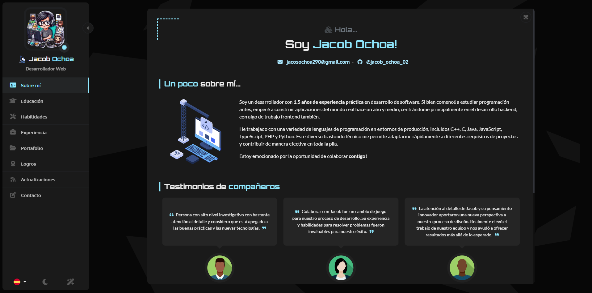
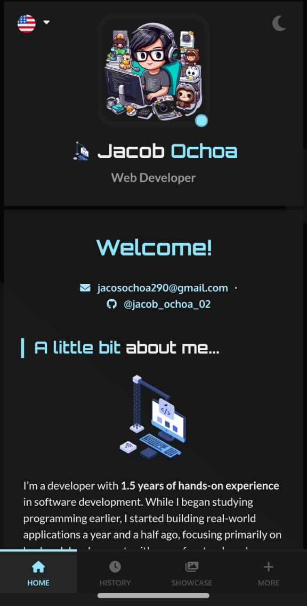

## [Live Preview](https://ryanbalieiro.github.io/react-portfolio-template/)

Check out the live version of the template deployed **[here on GitHub Pages](https://ryanbalieiro.github.io/react-portfolio-template/)**.

### 1. Base layout

The layout uses a fixed central view with a left sidebar, adjusting perfectly across various monitor resolutions, from 4:3 to ultra-wide.



### 2. Desktop Screenshots

The main view transitions smoothly when a new page is selected from the sidebar, giving a page-flipping effect. The sidebar is also toggleable, allowing the content area to expand for a larger viewing space.


### 3. Mobile Screenshots

On mobile, the layout groups the portfolio sections into categories and transforms into a tabbed interface with a bottom navigation.



## Installation

1. Clone the repo:

```
git clone https://github.com/Jacob-ochoa-02/portfolio-def
```

2. Go to the root directory of the project and install all dependencies with npm:

```
npm install
```

3. Run the project in developer mode:

```
npm run dev
```

4. To temporarily deactivate the preload animation during theme adjustments, go to `public/data/settings.json` and modify the following field:

```
"preloader": {
    "enabled": false,
    (...)
},
```
